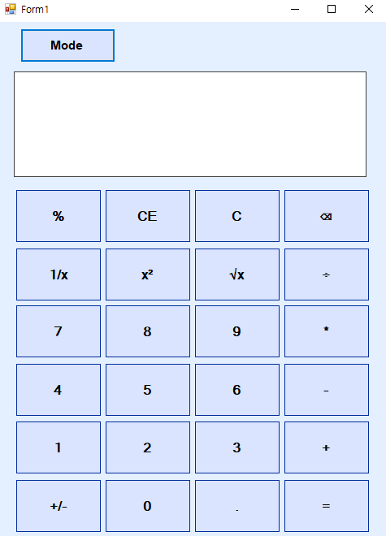

# 미니프로젝트 계산기

태그:  
C#, Winform   

프로젝트 링크:  
https://www.notion.so/23f86b77e264809c85e2dac1cfd021fe?source=copy_link

프로젝트 시작:   
2025년 5월 2일   

마감 일자:   
2025년 5월 5일   

인원:   
서예경, 이승민

# 🎨디자인

---

# 🧠기획

---

## <시스템>

- 윈도우 계산기

## <목적>

- C# 및 WinForm UI 구성 학습
- 이벤트 기반 프로그래밍 이해
- 실제 Windows 계산기 유사 기능 구현 경험
- 온도 변환 계산기를 통해 `조건문`, `라디오버튼`, `텍스트박스` 등의 컨트롤 요소 활용 연습

## <타겟>

- Window계산기 사용자

## <역할>

- 승민
    - Github repo 생성
    - 기본 UI 만들기
    - clear, sqrt, +/- 등 연산 함수
    - Button으로 Panel 전환
    - 온도 변환 계산기 전체 기능

- 예경
    - 파일 구조화 및 기본 기능
    - 수식 입력 시 화면에 출력하는 기능
    - 입력된 수식 분석 (parse) 기능
    - +-*/%, CE 등의 연산 기능
    - Button으로 Panel 전환 기능
    

# 🏗️전체 구조

---

## **<설계>**

- **구조**
1. Build & Run → Program.cs → Form1.cs
2. Form1.cs 내부에 추가한 Panel에 StandardVersion.cs (표준계산기) 출력
3. 상단의 Toggle Button 클릭 시 Panel의 class가 TempConverter.cs로 전환됨 (반대로도 동작)
- **기능**
    - 기본 UI Design
    - 버튼 누를 때마다 Text창에 출력
    - 입력된 수식 분석 (parse)
    - 연산 수행
    - Button 눌러 Panel 전환 (표준 계산기⭤ 온도 변환 계산기)
    - 온도 변환

## <기능 설계>

- **class**

| StandardVersion.cs | 표준 계산기 |
| --- | --- |
| Operation.cs | 표준 계산기 연산 모음집 |
| TempConverter.cs | 온도 변환 계산기 |
| TempConverterLogin.cs | 온도 변환 연산 모음집 |
- **기능**
    - Panel 이용한 UserControl 상태 관리
    - Regex class 활용한 수식 쪼개기 ( a + b 를 a, +, b로 쪼개기)
    - Math class 내장 메소드 활용 (Pow, Sqrt 등)
    - 버튼 이벤트 통합 (버튼마다 이벤트 생성 X)
    - TryParse 이용한 예외 처리
    

# 🔔핵심 로직

---

- Panel 전환 이벤트
    
    
    
    
    초기 Form1.cs 실행 시 표준 계산기 객체 만들어 Panel에 띄움
    
    
    
    
    
    버튼 클릭 시 ‘온도 변환 계산기’로 Panel의 내용 전환
    
    
    
- 버튼 클릭 시 이벤트
    
    
    
    
    이와 비슷한 맥락의 이벤트 메소드 많음.
    연산자가 두번 입력되는 경우 뒤에 넣은 연산자를 변경하거나 같은 기호가 추가되지 않게 예외처리
    
    
    
- =(계산 버튼) 누를 시 이벤트(사칙연산)
    
    
    
    
    
    
    - 문자열을  쪼개서 문자열 배열에 저장
    - a 와 b를 splited배열에서 차례대로 저
    - op에 MatchCollection으로 찾은 연산자를 저장
    - 결과 출력
    
- CE 누를 시 이벤트
    
    
    
    조건문을 통해 문자열 배열의 길이를 조건으로 splited[0], 즉 int a를 다시 꺼내오는 이벤트
    
- 자동 계산 함수
    
    
    
    if문 + switch문을 통해 숫자 + 연산자 + 숫자 형태의 수식을 자동으로 계산하는 함수(추가 연산자를 누를경우 발생)
